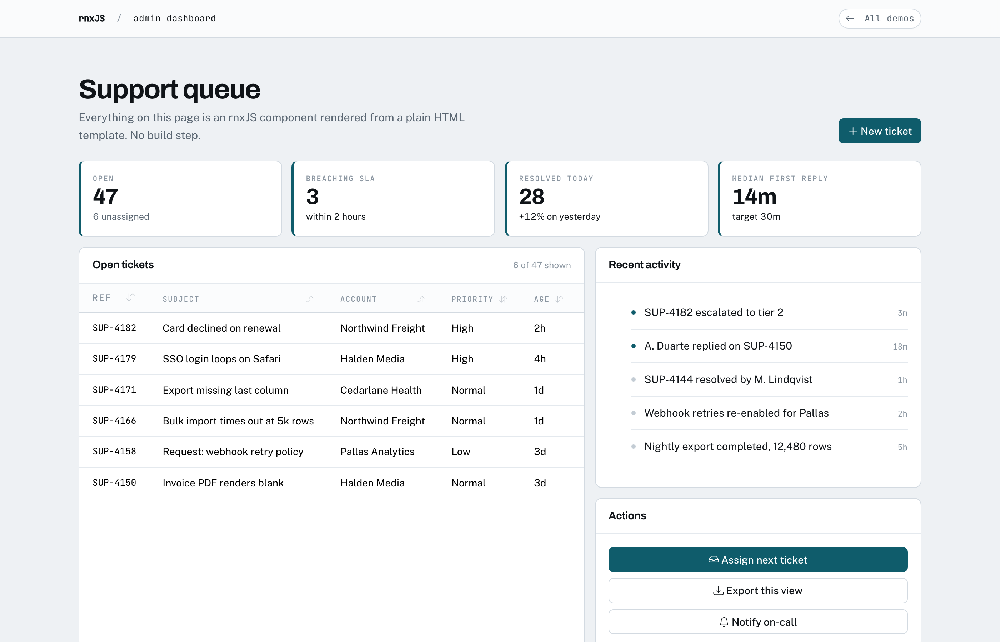

# rnxJS

**Sortable tables, date pickers, modals, and 43 more components. In a script tag, in the template you already have.**

No Node. No build step. No frontend toolchain. Drop them into a Django, Rails or Laravel template, or plain HTML.

[](https://www.npmjs.com/package/@arnelirobles/rnxjs)
[](https://www.npmjs.com/package/@arnelirobles/rnxjs)
[](https://bundlephobia.com/package/@arnelirobles/rnxjs)
[](https://github.com/BaryoDev/rnxjs/blob/main/LICENSE)

```html
<link href="https://cdn.jsdelivr.net/npm/bootstrap@5/dist/css/bootstrap.min.css" rel="stylesheet">
<script src="https://cdn.jsdelivr.net/npm/@arnelirobles/rnxjs/dist/rnx.global.js"></script>

<DataTable sortable filterable></DataTable>
```

That is the whole setup. No `npm install`, no bundler, no `package.json`.

Link `rnx.css` as well and that markup renders like this, with no styling of
your own:



Every screen above is rnxJS components in a plain HTML file. There is a live
version at [playground.baryo.dev/rnxjs](https://playground.baryo.dev/rnxjs/).

## Who this is for

You write Django, Rails, Laravel or Express. You need an admin screen with a sortable table and a date picker by Friday. You do not want to stand up a separate React repo, learn a build pipeline, and maintain two deployments to get there.

rnxJS gives you the components without the toolchain. It renders into the templates you already serve.

**Not for you if:** you are building a large single-page application. Use a real framework. rnxJS is for server-rendered apps that need interactive pieces.

---

## The 46 components

**Data and tables**
`DataTable` `VirtualList` `List` `Pagination` `StatCard` `Search` `Autocomplete`

**Forms**
`Input` `Textarea` `Select` `Checkbox` `Radio` `Switch` `Slider` `DatePicker` `FileUpload` `FormGroup` `SegmentedButton` `Chips`

**Navigation**
`NavigationBar` `NavigationDrawer` `Sidebar` `TopAppBar` `Breadcrumb` `Tabs` `Stepper` `Dropdown`

**Feedback and state**
`Alert` `Toast` `Modal` `Tooltip` `Spinner` `ProgressBar` `Skeleton` `EmptyState` `ErrorState` `ErrorBoundary` `Badge`

**Layout**
`Container` `Row` `Column` `Card` `Accordion`

**Actions**
`Button` `FAB` `Icon`

Full reference with props and examples: [Component Library](./docs/COMPONENTS.md)

---

## Styling and customization

Components come unstyled by default and take their look from a stylesheet.
Link `rnx.css` and you get a considered default without making any decisions:

```html
<link href="https://cdn.jsdelivr.net/npm/bootstrap@5/dist/css/bootstrap.min.css" rel="stylesheet">
<link href="https://cdn.jsdelivr.net/npm/@arnelirobles/rnxjs/css/rnx.css" rel="stylesheet">
```

Everything below is optional. Take it in the order that suits you: most people
never get past the first step.

### 1. Change the colours and shapes

`rnx.css` is built entirely from CSS custom properties. Set them in your own
stylesheet, after the link above, and every one of the 46 components follows.
No JavaScript, no build step, no forking:

```css
:root {
  --rnx-primary: #7c3aed;
  --rnx-border-radius: 12px;
  --rnx-font-family: "Inter", system-ui, sans-serif;
}
```

That is the whole of theming for most projects. Buttons, tables, inputs,
modals, the focus rings and the page furniture all recolour together.

The full list lives in [`css/themes/base.css`](./css/themes/base.css). The ones
worth knowing:

| Token | Controls |
|---|---|
| `--rnx-primary` | the accent, everywhere |
| `--rnx-success` `--rnx-danger` `--rnx-warning` | status colours, deliberately separate from the accent |
| `--rnx-background` `--rnx-surface` | the page, and the panels on it |
| `--rnx-text-primary` `--rnx-text-secondary` | ink |
| `--rnx-border-color` `--rnx-border-radius` | lines and corners |
| `--rnx-font-family` `--rnx-font-family-display` `--rnx-font-family-monospace` | body, headings, code |

A dark theme is the same tokens under a media query:

```css
@media (prefers-color-scheme: dark) {
  :root {
    --rnx-background: #0f1418;
    --rnx-surface: #161d23;
    --rnx-text-primary: #e6ecf1;
    --rnx-border-color: #26313a;
  }
}
```

### 2. Override one component

Every component accepts `className`, and those classes are applied last so they
win:

```html
<Button variant="primary" label="Save" className="my-save-button" />
```

```css
.my-save-button { letter-spacing: 0.04em; text-transform: uppercase; }
```

### 3. Replace the class map

If you are not using Bootstrap at all, a theme is a map of class strings per
component. This is how the built-in Tailwind theme works:

```javascript
import { registerTheme, setTheme } from '@arnelirobles/rnxjs';

registerTheme({
  name: 'my-theme',
  components: {
    button: {
      base: 'my-btn',
      variants: { primary: 'my-btn-primary' },
      sizes: { sm: 'my-btn-sm', md: '', lg: 'my-btn-lg' }
    }
  }
});
setTheme('my-theme');
```

Components are theme-agnostic, so the same markup renders correctly under any
registered theme:

```html
<Button variant="primary" label="Save changes"></Button>
<!-- bootstrap: class="btn btn-primary" -->
<!-- tailwind:  class="inline-flex items-center ... bg-indigo-600 text-white ..." -->
```

Switch with `setTheme('bootstrap')` or `setTheme('tailwind')`.

### What is not supported yet

Changing a component's internal markup. `Autocomplete` and `VirtualList` accept
a `renderItem` function; nothing else does. Slots are
[tracked separately](https://github.com/BaryoDev/rnxjs/issues/30).

---

## Zero to Hero: Build Your First App

Welcome to rnxJS! In this 5-minute tutorial, we'll build a reactive **Employee Directory** with a search filter. No Webpack, no Bundlers, just HTML and JS.

### Step 1: The Setup (`index.html`)

Create an `index.html` file and include Bootstrap + rnxJS.

```html
<!DOCTYPE html>
<html>
<head>
    <title>rnxJS App</title>
    <!-- 1. Bootstrap CSS -->
    <link href="https://cdn.jsdelivr.net/npm/bootstrap@5.3.2/dist/css/bootstrap.min.css" rel="stylesheet">
    <!-- 2. Bootstrap Icons (needed for the icon prop) -->
    <link href="https://cdn.jsdelivr.net/npm/bootstrap-icons@1.11.3/font/bootstrap-icons.min.css" rel="stylesheet">
    <!-- 3. rnxJS M3 Theme (Optional, for Material Styling) -->
    <link href="https://cdn.jsdelivr.net/npm/@arnelirobles/rnxjs/css/bootstrap-m3-theme.css" rel="stylesheet">
</head>
<body class="bg-light">

    <!-- App Container -->
    <Container class="py-5" id="app">
        <!-- We will put our content here -->
    </Container>

    <!-- 4. rnxJS Library -->
    <script src="https://cdn.jsdelivr.net/npm/@arnelirobles/rnxjs/dist/rnx.global.js"></script>
    <script src="app.js"></script>
</body>
</html>
```

### Step 2: The Logic (`app.js`)

Create `app.js`. We'll initialize our **Reactive State**.

```javascript
// app.js
const { createReactiveState, autoRegisterComponents, loadComponents } = rnx;

// 1. Define your data model
const state = createReactiveState({
    searchQuery: '',
    employees: [
        { id: 1, name: 'Alice Johnson', role: 'Engineer', dept: 'Tech' },
        { id: 2, name: 'Bob Smith', role: 'Designer', dept: 'Creative' },
        { id: 3, name: 'Charlie Kim', role: 'Manager', dept: 'Sales' },
    ],
    // Computed property (derived state works by manually updating or logical getters)
    // For simplicity in rnxJS v0, we handle filtering in the view or listeners
});

// 2. Register Bootstrap Components
autoRegisterComponents();

// 3. Hydrate the DOM
loadComponents(document.body, state);
```

### Step 3: The UI

Update the `<Container>` in `index.html`. We use `data-bind` to sync inputs and text.

```html
<Container class="py-5" id="app">
    <Card class="mb-4">
        <h2 class="mb-3">Employee Directory</h2>
        
        <!-- Search Input: Two-way binding to 'searchQuery' -->
        <FormGroup>
            <Input 
                placeholder="Search employees..." 
                data-bind="searchQuery" 
            />
            <small class="text-muted">
                Searching for: <span data-bind="searchQuery" class="fw-bold"></span>
            </small>
        </FormGroup>
    </Card>

    <Row id="employee-list">
        <!-- We will render the list here dynamically -->
    </Row>

    <!-- Floating Action Button -->
    <FAB icon="add" variant="primary" onclick="alert('Add Employee Clicked!')"></FAB>
</Container>
```

### Step 4: Making it Dynamic

rnxJS works great with vanilla JS logic. Let's add a listener to filter the list.

```javascript
// Add this to app.js

function renderList() {
    const listContainer = document.getElementById('employee-list');
    const query = state.searchQuery.toLowerCase();
    
    // Filter logic
    const filtered = state.employees.filter(emp => 
        emp.name.toLowerCase().includes(query) || 
        emp.role.toLowerCase().includes(query)
    );

    // Vanilla JS rendering (fast and simple)
    listContainer.innerHTML = filtered.map(emp => `
        <div class="col-md-4 mb-3">
            <div class="card h-100">
                <div class="card-body">
                    <h5 class="card-title">${emp.name}</h5>
                    <h6 class="card-subtitle mb-2 text-muted">${emp.dept}</h6>
                    <p class="card-text">${emp.role}</p>
                </div>
            </div>
        </div>
    `).join('');
}

// Subscribe to search changes to re-render
state.subscribe('searchQuery', renderList);

// Initial render
renderList();
```

🎉 **That's it!** You have a reactive app with search and Bootstrap styling.

---

## Core Concepts & API

### 1. Reactive State
The heart of rnxJS is the `createReactiveState` function. It wraps your object in a Proxy to detect changes.

```javascript
const state = rnx.createReactiveState({
    user: { name: 'Arnel', points: 100 },
    items: ['Apple', 'Banana']
});
```

**Key Features:**
- **Deeply Nested**: Works on `state.user.name`.
- **Arrays**: `push`, `pop`, `splice` trigger updates automatically.
- **`state.subscribe(path, callback)`**: Listen for changes.
    - Path examples: `'user.name'`, `'items'`, `'items.0'`.
- **`state.$unsubscribeAll()`**: Cleanup all listeners (useful for Single Page Apps).

### 2. Data Binding (`data-bind`)
Connect your DOM to State without event listeners.

| Element                  | Binding Type | Behavior                                                |
| :----------------------- | :----------- | :------------------------------------------------------ |
| `<input>`, `<textarea>`  | **Two-Way**  | Updates state on typing; updates value on state change. |
| `<select>`               | **Two-Way**  | Updates selection state.                                |
| `<checkbox>`             | **Two-Way**  | Binds to boolean state.                                 |
| `<div>`, `<span>`, `<p>` | **One-Way**  | Updates `textContent` when state changes.               |

**Validation (`data-rule`)**:
Add rules to inputs to populate `state.errors`.
```html
<input data-bind="email" data-rule="required|email" />
<span class="text-danger" data-bind="errors.email"></span>
```
Rules: `required`, `email`, `numeric`, `min:5`, `max:10`, `pattern:^A.*`.

### 3. Components (`rnxJS Components`)
rnxJS provides **46 production-ready** components.

**Standard**: `<Button>`, `<Card>`, `<Modal>`, `<Alert>`, `<Badge>`, `<Spinner>`, `<Toast>`.
**Forms**: `<Input>`, `<Checkbox>`, `<Radio>`, `<Select>`, `<Textarea>`, `<Switch>`, `<Slider>`, `<FileUpload>`.
**Layout**: `<Container>`, `<Row>`, `<Column>`, `<Sidebar>`.
**Material (M3)**: `<FAB>`, `<Chips>`, `<NavigationDrawer>`, `<TopAppBar>`, `<List>`, `<Icon>`.
**Advanced**: `<DataTable>`, `<Dropdown>`, `<ProgressBar>`, `<Stepper>`, `<Tooltip>`, `<Tabs>`, `<Accordion>`, `<Pagination>`.

**Usage:**
1. **Auto Register**: `rnx.autoRegisterComponents()` registers all of them.
2. **Manual Register**: `rnx.registerComponent('MyBtn', Button)`.
3. **Props**: Attributes are passed as props. `data-bind` works on components too!
   ```html
   <Input label="Name" data-bind="user.name" />
   <!-- Renders a labeled input group bound to user.name -->
   ```

### 4. Lifecycle Hooks
When creating custom components, use hooks to manage resources.

```javascript
const component = createComponent(templateFn, props);

component.useEffect((self) => {
    console.log('Mounted!');
    
    const interval = setInterval(() => console.log('Tick'), 1000);
    
    // Return cleanup function (called on unmount)
    return () => clearInterval(interval);
});

component.onUnmount(() => {
    console.log('Destroyed');
});
```

---

## Project Structure

For a clean codebase, we recommend this folder structure:

```text
/
├── index.html        # Entry point
├── css/
│   └── styles.css    # Custom styles / overlays
├── js/
│   ├── app.js        # Main logic (State init, Load)
│   ├── components/   # Custom components
│   │   └── UserCard.js
│   └── utils/        # Helpers
└── assets/
```

### Building Custom Components
Create reusable functional components:

```javascript
// js/components/UserCard.js
import { createComponent } from '@arnelirobles/rnxjs';

export function UserCard({ name, role }) {
    // Template
    const template = (state) => `
        <div class="card shadow-sm">
            <div class="card-body">
                <h3>${name}</h3>
                <p class="text-muted">${role}</p>
            </div>
        </div>
    `;

    return createComponent(template);
}

// Register it
import { registerComponent } from '@arnelirobles/rnxjs';
registerComponent('UserCard', UserCard);
```

Use it in HTML: `<UserCard name="John" role="Dev"></UserCard>`

---

## Installation Options

### 1. CDN (recommended)

Use `unpkg` or `jsdelivr`.

```html
<!-- Library -->
<script src="https://cdn.jsdelivr.net/npm/@arnelirobles/rnxjs/dist/rnx.global.js"></script>

<!-- M3 Theme CSS -->
<link href="https://cdn.jsdelivr.net/npm/@arnelirobles/rnxjs/css/bootstrap-m3-theme.css" rel="stylesheet">
```

---

### 2. NPM (if you already have a bundler)

```bash
npm install @arnelirobles/rnxjs
```

```javascript
import { createReactiveState, loadComponents } from '@arnelirobles/rnxjs';
import '@arnelirobles/rnxjs/css/bootstrap-m3-theme.css'; // Optional M3 theme
```

## Why rnxJS?

| Feature                   | rnxJS                              | jQuery   | Vue 3         | React 18   |
| ------------------------- | ---------------------------------- | -------- | ------------- | ---------- |
| **Bundle Size (gzipped)** | ~42KB *(includes 46 components)*   | ~30KB    | ~16KB         | ~42KB      |
| **Zero Build Required**   | **✅ Yes**                          | ✅ Yes    | ⚠️ Recommended | ❌ Required |
| **Built-in Components**   | **46**                             | 0        | 0             | 0          |
| **Two-Way Binding**       | **✅ Built-in**                     | ❌ Manual | ✅ v-model     | ❌ Manual   |
| **Form Validation**       | **✅ Built-in**                     | ❌ Plugin | ❌ Library     | ❌ Library  |
| **Learning Curve**        | **1 hour**                         | 1 hour   | 1 day         | 1 week     |
| **Backend Integration**   | **✅ Django/Rails/Laravel/Express** | ✅ Any    | ⚠️ Nuxt        | ⚠️ Next.js  |

**Perfect for:**
- **Backend Devs**: Django/Rails/Laravel developers who want interactivity without a separate SPA repo.
- **Internal Tools**: Rapidly build admin panels using standard Bootstrap.
- **Prototypes**: "Zero to Hero" in 5 minutes.
- **jQuery Migrations**: Modern reactivity with similar simplicity.

See [full benchmarks](./docs/BENCHMARKS.md) for detailed performance comparisons.

---

## Icons

rnxJS now uses **Bootstrap Icons** by default. Ensure you include the Bootstrap Icons stylesheet in your project:

```html
<link rel="stylesheet" href="https://cdn.jsdelivr.net/npm/bootstrap-icons@1.11.3/font/bootstrap-icons.min.css">
```

When using the `icon` prop in components like `Button`, `FAB`, `Icon`, etc., simply provide the icon name (e.g., `moon-stars`, `check-circle`). The library automatically applies the `bi bi-[name]` classes.

```html
<Button icon="moon-stars" label="Theme" />
<Icon name="check-circle" color="text-success" />
```

## Documentation

| Guide                                                          | Description                                                       |
| -------------------------------------------------------------- | ----------------------------------------------------------------- |
| [**📰 v1.0.0 Release Post**](./docs/BLOG-V1.0.0.md)             | Complete overview of v1.0.0 features, benchmarks, and comparisons |
| [**Quick Start**](./docs/QUICK-START.md)                       | Get started in 5 minutes                                          |
| [**Component Library**](./docs/COMPONENTS.md)                  | Complete reference for all 46 components with examples            |
| [**API Reference**](./docs/API.md)                             | Complete API documentation with stability guarantees              |
| [**Migration Guide**](./docs/MIGRATION.md)                     | Migrate from jQuery to rnxJS                                      |
| [**Benchmarks**](./docs/BENCHMARKS.md)                         | Performance comparisons with jQuery, Vue, React                   |

---
## Troubleshooting & FAQ

### 1. My `<FAB>` or custom component isn't rendering
- Ensure you have called `rnx.autoRegisterComponents()` or manually registered it via `rnx.registerComponent('FAB', FAB)`.
- Check that the Bootstrap Icons stylesheet is included if icons are missing. rnxJS uses Bootstrap Icons (`bi bi-*`), not Material Symbols.
- If using `data-if`, ensure the condition evaluates to true.

### 2. Data Binding isn't working on some elements
- As of **v0.3.4**, `data-bind` is synchronous. Ensure `loadComponents(document, state)` is called **after** the DOM is ready (e.g., at the end of `<body>` or inside `DOMContentLoaded`).
- Check your browser console for warnings like `[rnxJS] Invalid data-bind path`.
- Ensure your state object was created with `createReactiveState`.

### 3. "Bootstrap is not defined" error
- Use `setBootstrap(window.bootstrap)` if you are using a bundler and Bootstrap isn't attached to the global window object.

### 4. How to contribute?
- We welcome contributions! Please verify potential changes with existing tests: `npm test`.

---

---

## Project status

- **Tests**: 696 tests across 39 files, running in under 4 seconds. 690 pass; 6 are known failures with open issues against them ([#23](https://github.com/BaryoDev/rnxjs/issues/23), [#24](https://github.com/BaryoDev/rnxjs/issues/24), [#25](https://github.com/BaryoDev/rnxjs/issues/25)).
- **CI**: not yet running the suite on pull requests. Tracked in [#2](https://github.com/BaryoDev/rnxjs/issues/2).
- **Browser support**: all modern browsers (Chrome, Firefox, Safari, Edge).
- **Dependencies**: the CDN build needs only Bootstrap CSS.
- **Maintenance**: actively maintained, not actively expanded. The component count is deliberately frozen at 46. Bug reports and pull requests are welcome and get read.

---

## Scaffolding and samples

Working examples: [rnxJS_samples](https://github.com/BaryoDev/rnxJS_samples)

---

## Contributing

Issues labelled [`good first issue`](https://github.com/BaryoDev/rnxjs/labels/good%20first%20issue) carry the file, the line, and the actual failing assertion, so they are pickable without rediscovering anything.

Before opening a pull request, run `npm test`. Note the 6 known failures above; if your change adds an eighth, that one is yours.

Full changelog: [CHANGELOG.md](./CHANGELOG.md)

---

## License

MPL-2.0 © Arnel Isiderio Robles
